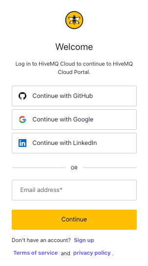
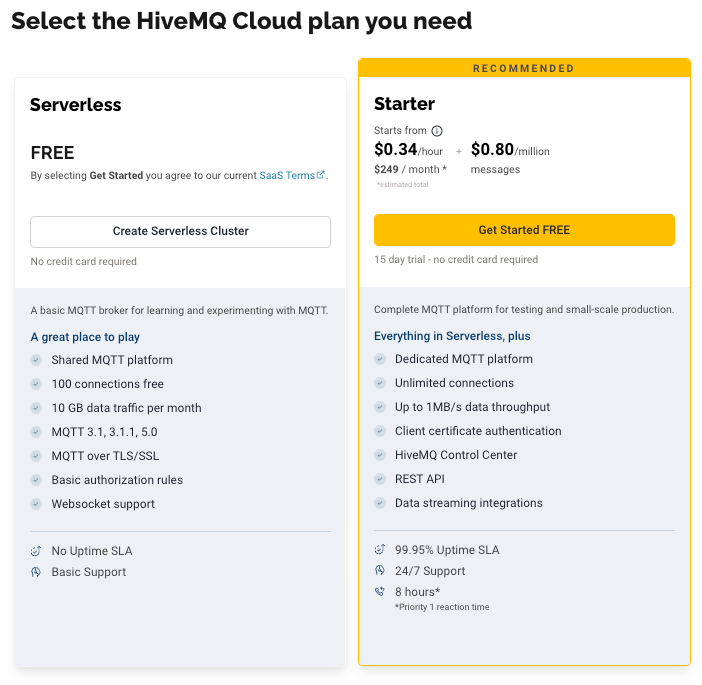
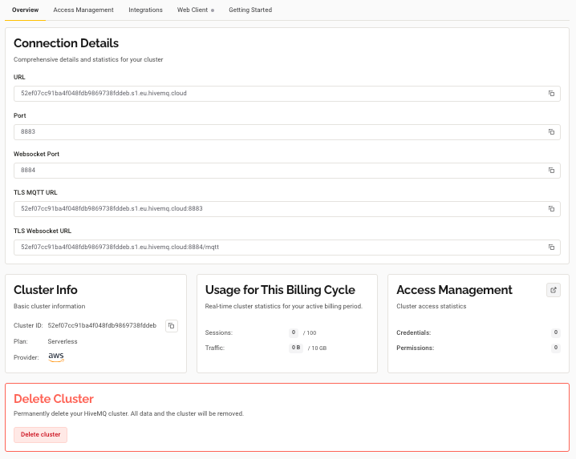
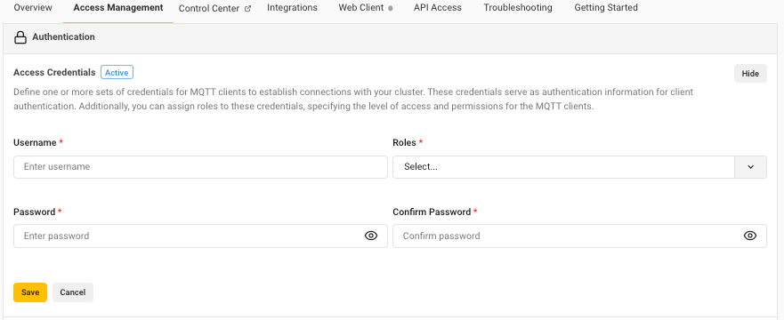
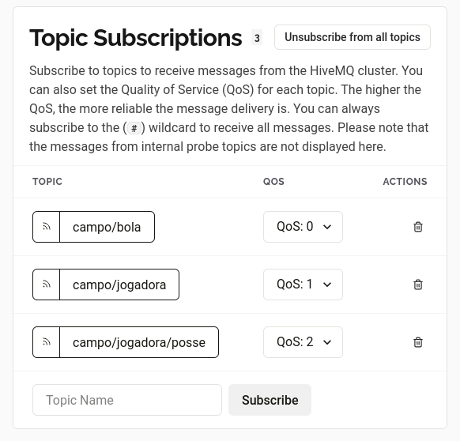

# SPRINT 3 - Ecossistema Tech PBS01

## Desenvolvido Por 
* **Carlos Eduardo Sanches mariano Rm: 561756**
* **Leonardo Eiji Kina RM: 562784**
* **Luís Scacchetti Mariano RM: 562241**
* **Rodrigo do Santos Abubakir RM: 561479**
* **Vitor Ramos de Farias RM: 561958**

## 💡Resumo
Um dos desafios enfrentados pelo futebol feminino é a falta de investimento em estruturas adequadas para a coleta de dados necessários dos jogos e atletas. Essa carência de informações confiáveis contribui para a desvalorização do esporte e dificulta análises de desempenho aprofundadas.

Visando essa problemática, a Synapse apresenta uma solução simples e acessível, que fornece dados de jogo em tempo real, permitindo uma análise mais profunda do desempenho das atletas e equipes. 

Essa solução permite que a coleta de dados seja mais eficiênte e confiável, e em conjunto com o portal Passa a Bola, facilitamos a busca por informações confiáveis, o que demonstra o valor e potencial das atletas, aumentando a visibilidade do esporte e por consequência atraindo mais investimento.

---

### ✨ Nossa solução

O PBS01 utiliza os 4 fundamentos do conceito de internet das coisas em sua arquitetura:
* **Coleta de Dados:** Durante o jogo coletamos o número da camisa com coordenadas das jogadoras.
* **Dispositivos:** Usamos módulos ESP32S com GPS NEO-6M acoplados a camisetas, à bola e ao gol. Esses dispositivos se conectam a uma rede Wi-Fi e publicam os dados em um broker MQTT em nuvem, o HiveMQ Cloud.
* **Análise de Dados:** Com esses dados publicados, usamos o node-red para analisar e manipular os dados, identificando momentos de posse de bola e a autoria dos gols, posteriormente, publicamos novamente no broker r atualizamos essas informações em tempo real no Portal Passa a Bola, enriquecendo o perfil das atletas e a experiência do torcedor. 
* **Conectividade:** Todos os componentes, por meio do WI-FI são conectados a um broker em nuvem, formando uma rede de comunicação robusta.

---

### ⛏️ Componentes e Tecnologias
* **ESP32S**
* **Módulo GPS NEO-6M** 
* **Broker MQTT em nuvem:** Utilizamos o **HiveMq Cloud**, mas você pode utilizar um de sua preferencia.
* **Gerenciamento de fluxo de dados: Node-RED** para automação e manipulação de fluxos de dados..
* **Virtualização: Docker** para criar um contêiner do Node-RED e gerenciar o ambiente de forma isolada e eficiente.
* **Health Check: Postman** para testar a comunicação e garantir o correto recebimento dos dados.

---
## 🚀Rodando Projeto na Máquina
Siga as instruções abaixo para configurar o ambiente na sua máquina.
### 🧑‍🚀 Instalando Postman
Instale o Postman pelo site oficial e siga o passo a passo: ["Download Postman"](https://learning-postman-com.translate.goog/docs/getting-started/installation/installation-and-updates/?_x_tr_sl=en&_x_tr_tl=pt&_x_tr_hl=pt&_x_tr_pto=tc&_x_tr_hist=true)
### 🐝 Configurando Hivemq Cloud
1. Acesse o site oficial do [HiveMQ Cloud](https://www.hivemq.com/company/get-hivemq/). e faça seu cadastro:
    
2. Escolha seu plano: 
    
3. Esse é seu Cluster, grave essas informaçẽos para preencher a conexão entre o Node-RED e o Broker:
    
4. Crie suas credenciais e deixando suas regras como Publisher e Subscriver:
    
5. Adicione os seguintes tópicos:
    
### 💾 Instalando Sistema IOT
#### 🐋 Instalando Docker
##### Fedora Linux
1. Atualize os pacoes do seu sistema: 
   ```bash
    sudo dnf update
   ```
2.  Instale o pacote dnf-plugins-core:
    ```bash
    sudo dnf -y install dnf-plugins-core
    ```

3.  Adicione o repositório do Docker:
    ```bash
    sudo dnf-3 config-manager --add-repo https://download.docker.com/linux/fedora/docker-ce.repo
    ```

4.  Instale o Docker Engine:
    ```bash
    sudo dnf install docker-ce docker-ce-cli containerd.io docker-buildx-plugin docker-compose-plugin
    ```

5.  Inicie o serviço do Docker:
    ```bash
    sudo systemctl start docker
    ```
6. Adicione seu usuário ao grupo docker para evitar usar sudo nos comandos:
    ```bash
        sudo usermod -aG docker $USER
    ```
    **⚠️ Importante**: Você precisa fazer logout e login novamente para que a alteração tenha efeito.

##### Windows

1. Instalando Docker Desktop

    1. Baixe o instalador do Docker Desktop no site oficial.

    2. Execute o instalador e siga as instruções na tela. O Docker Desktop vai instalar todos os componentes necessários (Docker Engine, Docker CLI, Docker Compose).

    3. Após a instalação, inicie o Docker Desktop. O ícone do Docker aparecerá na bandeja do sistema.

##### Ubuntu
1. Atualize os pacoes do seu sistema: 
   ```bash
    sudo apt-get update
   ```

2. Instale os pacotes necessários:
    ```bash 
    sudo apt-get install ca-certificates curl gnupg
    ```

3. Adicione a chave GPG oficial do Docker:
    ```bash 
    sudo install -m 0755 -d /etc/apt/keyrings
    curl -fsSL https://download.docker.com/linux/ubuntu/gpg | sudo gpg --dearmor -o /etc/apt/keyrings/docker.gpg
    sudo chmod a+r /etc/apt/keyrings/docker.gpg 
    ```

4. Configure o repositório do Docker:
    ```bash 
    echo "deb [arch="$(dpkg --print-architecture)" signed-by=/etc/apt/keyrings/docker.gpg] https://download.docker.com/linux/ubuntu "$(. /etc/os-release && echo "$VERSION_CODENAME")" stable" | sudo tee /etc/apt/sources.list.d/docker.list > /dev/null
    ```

5. Atualize o apt e instale o Docker:
    ```bash
    sudo apt-get update
    sudo apt-get install docker-ce docker-ce-cli containerd.io docker-buildx-plugin docker-compose-plugin
    ```

6. Adicione seu usuário ao grupo docker para evitar usar sudo nos comandos:
    ```bash
        sudo usermod -aG docker $USER
    ```
     **⚠️ Importante**: Você precisa fazer logout e login novamente para que a alteração tenha efeito.

##### macOS

Instalando Docker Desktop

1. Baixe o instalador do Docker Desktop para Mac no site oficial.

2. Abra o arquivo .dmg e arraste o ícone do Docker para a pasta Applications.

3. Inicie o Docker Desktop na sua pasta de aplicativos. O ícone do Docker aparecerá na barra de menus.

#### Criando Contêiner do Node-RED
1.  Para baixar a imagem e iniciar o contêiner:
    ```bash
    sudo docker run -it -p 1880:1880 --name <NOME DO CONTEINER> nodered/node-red
    ```

2.  Se você deseja persistir os dados, use o comando:
    ```bash
    docker run -it -p 1880:1880 -v node_red_data:/data --name <NOME DO CONTEINER> nodered/node-red
    ```
##### Comandos Adiconais Docker
1.  Verificar container:
    ```bash
    docker ps -a
    ```

2.  Inicie um contêiner do Docker:
    ```bash
    docker start <NOME DO CONTEINER>
    ```
3.  Pare um contêiner do Docker:
    ```bash
    docker stop <NOME DO CONTEINER>
    ```

### Configurando Node-RED
1. cesse a aplicação no seu navegador. O endereço estará disponível na porta indicada no terminal.
2. Baixe o Arquivo `flow.json`.
3. Importe o arquivo baixado no Node-RED.
4. Configure a URL do broker MQTT conforme as informações do seu cluster.

### 🧑‍🚀 Configurando Postman
1. Baixe o arquivo `PBS01.postman_collection.json`.
2. Importe o Arquivo no Postman.
3. Configure a variável HOST para o endereço da sua aplicação Node-RED.
   
### ▶️ Como Usar?   
Para iniciar o projeto e simular o envio de dados, clique no botão no fluxo Dados no seu painel do Node-RED.
    


